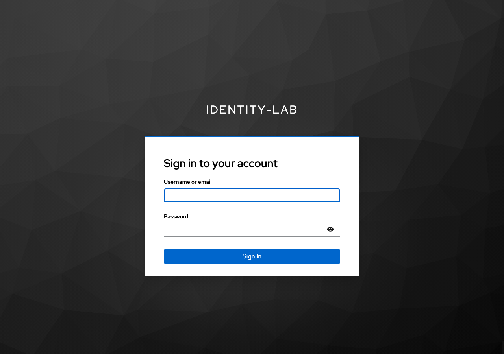
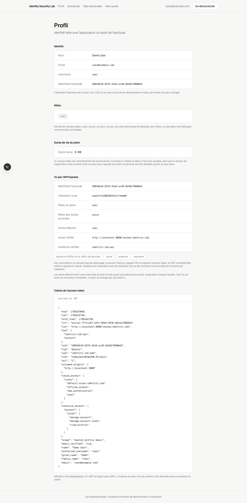
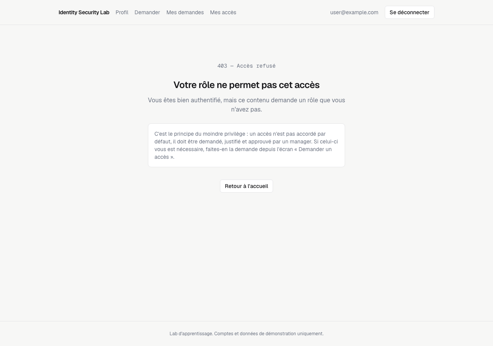
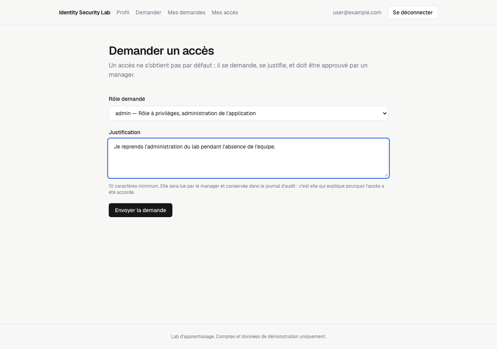
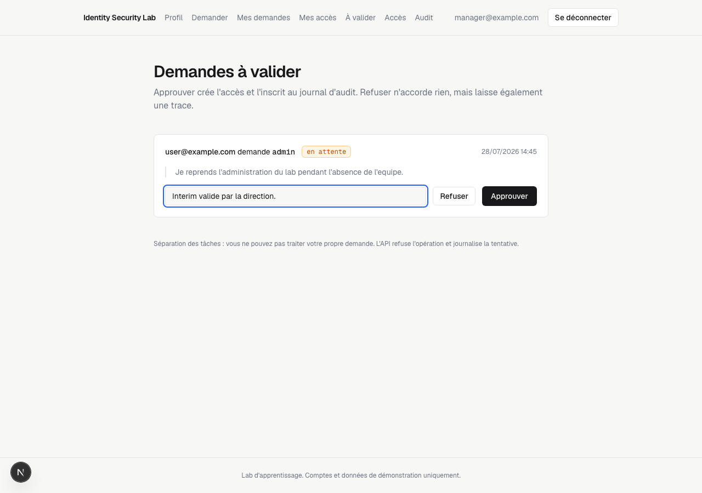
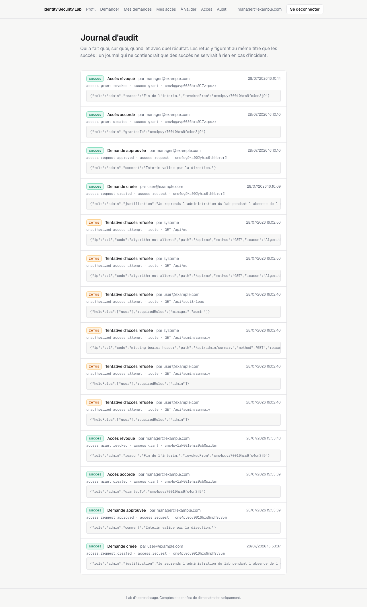
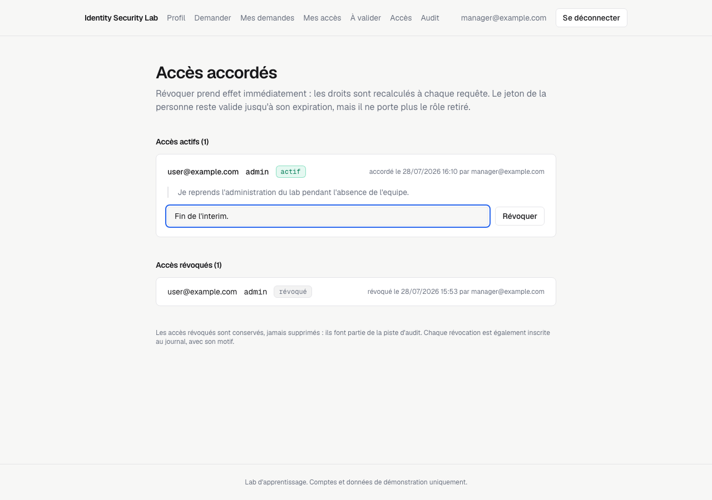
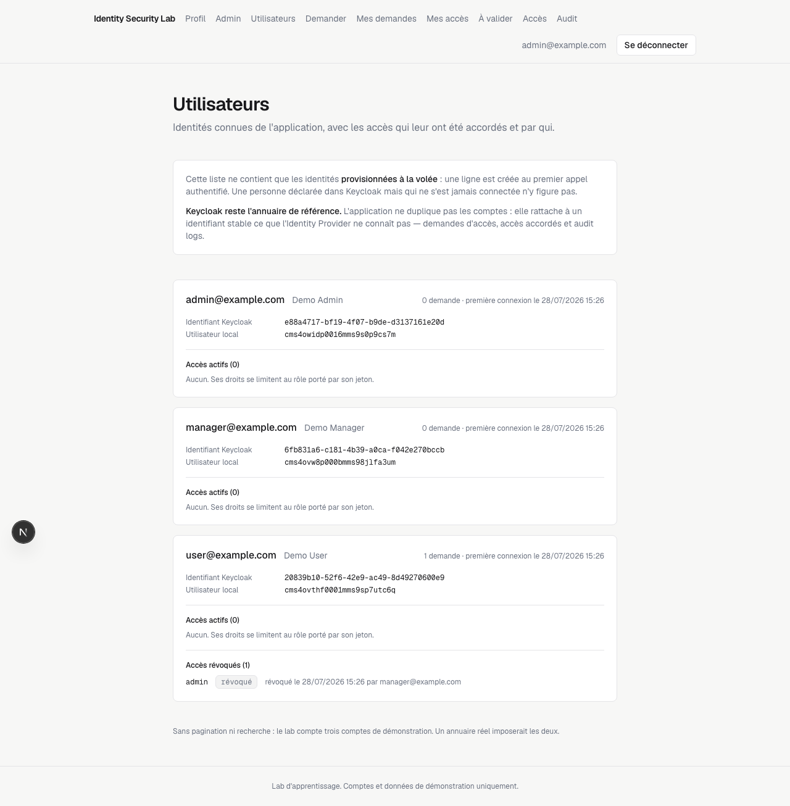

# Identity Security Lab

Mini lab IAM / IGA pour comprendre et démontrer les mécanismes clés de l'Identity & Access Management : SSO OpenID Connect, RBAC, demande d'accès, validation manager, révocation et audit logs.

Ce n'est pas une plateforme IAM de production. C'est un laboratoire d'apprentissage, pensé pour être lu, compris et expliqué.

## Objectif

Relier des concepts IAM souvent abstraits à une implémentation réelle. Le lab répond de bout en bout aux six questions de base de l'IAM :

- Qui est l'utilisateur ? Authentification OIDC déléguée à Keycloak.
- À quoi a-t-il accès ? Rôles effectifs calculés côté serveur.
- Pourquoi y a-t-il accès ? Demande d'accès justifiée.
- Qui l'a approuvé ? Validation manager, avec séparation des tâches.
- Quand faut-il le retirer ? Révocation immédiatement effective.
- Comment le prouver ? Audit log sur chaque action sensible.

## Statut

- Phase 1, fondation documentaire : terminée
- Phase 2, Keycloak et authentification : terminée
- Phase 3, RBAC : terminée
- Phase 4, workflow de demande d'accès : terminée
- Phase 5, accès et révocation : terminée
- Phase 6, finalisation : terminée

Le cycle complet fonctionne : connexion SSO, demande d'accès justifiée, validation manager, accès accordé, révocation, et journal d'audit sur chaque action sensible.

Le déroulé de démonstration est dans [docs/demo-script.md](docs/demo-script.md). Les évolutions envisagées sont listées plus bas.

## Architecture

```txt
                          Keycloak :8080
                            ▲          ▲
                    OIDC    │          │  JWKS
                            │          │
Navigateur → Next.js :3000 ─┘          └─ API Express :4000 → PostgreSQL :5432
             client OIDC                   resource server
                    └──── Bearer token ────────┘
```

Le découpage en deux services est volontaire. L'API est un resource server à part entière : elle valide elle-même la signature, l'issuer, l'audience et l'expiration de chaque jeton reçu, sans faire confiance à l'appelant.

Détail dans [docs/architecture.md](docs/architecture.md).

## Stack

- Frontend : Next.js (App Router), TypeScript, Tailwind
- Authentification : Auth.js v5, OpenID Connect
- Backend : Node.js, Express, TypeScript
- Identity Provider : Keycloak
- Base de données : PostgreSQL
- ORM : Prisma
- Infra locale : Docker Compose

## Installation

Prérequis : Docker, Docker Compose, Node.js 20 ou plus.

### 1. Configurer

```bash
git clone <url-du-repo>
cd identity-security-lab
cp .env.example .env
```

Générer un secret de session réel, la valeur par défaut est un texte indicatif :

```bash
tmp=$(mktemp)
sed "s|^AUTH_SECRET=.*|AUTH_SECRET=$(openssl rand -base64 32)|" .env > "$tmp" && mv "$tmp" .env
```

Écriture dans un fichier temporaire plutôt que `sed -i` : l'option ne s'écrit pas de la même façon sur macOS et sur Linux.

### 2. Démarrer l'infrastructure

```bash
docker compose up -d
```

Démarre PostgreSQL et Keycloak. Le premier lancement prend 30 à 60 secondes, le temps que Keycloak construise son schéma.

### 3. Vérifier que tout tourne

```bash
docker compose ps
```

Les deux services doivent être `running`, et Postgres `healthy`.

Les deux bases du lab :

```bash
docker compose exec postgres psql -U lab -d postgres -c "\l"
```

Le realm importé, via son endpoint de découverte OIDC :

```bash
curl -s http://localhost:8080/realms/identity-lab/.well-known/openid-configuration | jq .issuer
```

Doit renvoyer `http://localhost:8080/realms/identity-lab`.

Console d'administration : http://localhost:8080

Le détail des vérifications et le dépannage sont dans [docs/keycloak-setup.md](docs/keycloak-setup.md).

### 4. Préparer la base et lancer l'API

```bash
cd backend
npm install
npx prisma migrate dev     # crée les tables dans la base identitylab
npx prisma generate        # génère le client, non versionné
npx prisma db seed         # crée les rôles user, manager, admin
npm run dev
```

API sur http://localhost:4000. Elle lit le même `.env` que le reste du lab.

Les utilisateurs ne sont pas à créer : ils sont provisionnés à la volée au premier appel authentifié, à partir du claim `sub` du jeton.

L'API se lance avant le frontend : c'est elle qui crée les tables et sème les rôles. Lancer le frontend d'abord donnerait une application dont toutes les pages de données affichent une erreur.

### 5. Lancer le frontend

```bash
cd frontend
npm install
ln -sfn ../.env .env.local
npm run dev
```

Application sur http://localhost:3000

Next.js ne lit ses variables d'environnement que depuis son propre dossier. Le lien `.env.local` évite de dupliquer le fichier : il n'y a qu'un seul `.env`, à la racine.

Le frontend fonctionne même si l'API est arrêtée : une bande d'avertissement signale alors que seuls les rôles du jeton sont pris en compte.

### 6. Vérifier la validation des jetons

Obtenir un jeton puis appeler l'API :

```bash
source .env
TOKEN=$(curl -s -X POST "$KEYCLOAK_ISSUER/protocol/openid-connect/token" \
  -d "client_id=identity-lab-web" -d "client_secret=$KEYCLOAK_CLIENT_SECRET" \
  -d "username=user" -d "password=$DEMO_USER_PASSWORD" \
  -d "grant_type=password" | jq -r .access_token)

curl -s -H "Authorization: Bearer $TOKEN" http://localhost:4000/api/me | jq
```

Vérifier que le contrôle de rôle est bien appliqué par l'API, indépendamment de ce que le frontend affiche :

```bash
curl -s -H "Authorization: Bearer $TOKEN" http://localhost:4000/api/admin/summary | jq
```

Doit renvoyer un 403 avec le rôle requis et les rôles détenus. Sans en-tête `Authorization`, la même route renvoie 401.

## Configuration Keycloak

Le realm est versionné dans `keycloak/realm-export.json` et réimporté à chaque démarrage. Aucune configuration manuelle n'est nécessaire pour utiliser le lab.

Pour le reconstruire à partir de zéro et vérifier que l'export suffit :

```bash
docker compose down -v && docker compose up -d
```

Après toute modification dans la console, régénérer l'export avec `./scripts/export-realm.sh`.

- Realm : `identity-lab`
- Client frontend : `identity-lab-web`, confidentiel, Authorization Code + PKCE
- Audience API : `identity-lab-api`
- Redirect URI : `http://localhost:3000/api/auth/callback/keycloak`
- Rôles de realm : user, manager, admin
- Console admin : http://localhost:8080

La procédure de configuration manuelle, utile pour comprendre ce que contient l'export, est décrite dans [docs/keycloak-setup.md](docs/keycloak-setup.md).

## Variables d'environnement

Copier `.env.example` vers `.env`. Le fichier `.env` ne doit jamais être commité.

Infrastructure, utilisées par Docker Compose :

```txt
POSTGRES_USER             propriétaire des deux bases
POSTGRES_PASSWORD         mot de passe local
POSTGRES_PORT             port publié sur l'hôte, 5432 par défaut
KEYCLOAK_ADMIN            compte admin de la console Keycloak
KEYCLOAK_ADMIN_PASSWORD   mot de passe local
KEYCLOAK_PORT             port publié sur l'hôte, 8080 par défaut
```

Application, lues par l'API et par le frontend :

```txt
DATABASE_URL              connexion PostgreSQL de l'API
API_PORT                  port de l'API Express
KEYCLOAK_AUDIENCE         audience attendue dans l'access token
KEYCLOAK_ISSUER           http://localhost:8080/realms/identity-lab
KEYCLOAK_CLIENT_ID        identity-lab-web
KEYCLOAK_CLIENT_SECRET    généré par Keycloak lors de la création du client
AUTH_SECRET               secret de chiffrement des sessions
AUTH_URL                  http://localhost:3000
API_URL                   http://localhost:4000
```

Comptes de démonstration, créés dans Keycloak par l'import du realm :

```txt
DEMO_USER_PASSWORD
DEMO_MANAGER_PASSWORD
DEMO_ADMIN_PASSWORD
```

Les valeurs de `.env.example` sont des valeurs de démonstration locales, à ne jamais réutiliser ailleurs.

## Comptes de démonstration

```txt
user@example.com       rôle user
manager@example.com    rôle manager
admin@example.com      rôle admin
```

Mots de passe locaux, définis dans `.env.example`. Usage de démonstration uniquement.

## Fonctionnalités

- Authentification SSO via Keycloak, en Authorization Code + PKCE
- Profil utilisateur, claims décodés et compte à rebours d'expiration du jeton
- Renouvellement automatique de l'access token, avec écran dédié si la session SSO a expiré
- Aucun jeton exposé au navigateur : ni l'access token ni le refresh token ne quittent le serveur
- Tableau de bord annonçant ce que le rôle permet et les écrans qu'il ouvre
- Pages 401, 403 et 404 en français, avec les bons statuts HTTP
- Page d'erreur d'authentification expliquant chaque cas d'échec
- API resource server validant chaque jeton : signature RS256 via le JWKS de Keycloak, issuer, audience et expiration
- Contrôle de rôle serveur, renvoyant 401 sans identité et 403 avec un rôle insuffisant
- Provisionnement de l'utilisateur local à la volée, sur le claim `sub`
- Droits effectifs recalculés à chaque requête : rôles du jeton réunis aux accès accordés actifs
- Demande d'accès justifiée, file d'approbation, approbation et refus commentés
- Accès accordé rattaché à son approbateur, à sa justification et horodaté
- Séparation des tâches : personne ne traite sa propre demande
- Révocation immédiatement effective, sans changement de jeton
- Journal d'audit sur chaque action sensible, succès comme refus, réservé aux managers et admins
- Inventaire des identités provisionnées, réservé à l'admin, avec leurs accès et qui les a décidés

## Captures d'écran

### Connexion déléguée à Keycloak



Le mot de passe ne transite jamais par l'application.

### Profil et claims du jeton



La même identité apparaît deux fois : telle que l'application l'a reçue de Keycloak, et telle que l'API la reconstitue après avoir vérifié le jeton elle-même.

### Accès refusé



403 et non 401 : l'identité est connue, le rôle ne suffit pas.

### Demande d'accès



### File d'approbation



### Journal d'audit



Les refus y figurent au même titre que les succès.

### Accès accordés et révocation



### Inventaire des identités



Seules les identités provisionnées à la volée y figurent : Keycloak reste l'annuaire de référence.

Les autres écrans : [accueil public](docs/screenshots/home.png), [tableau de bord](docs/screenshots/dashboard.png), [mes demandes](docs/screenshots/my-requests.png), [mes accès](docs/screenshots/my-access.png), [administration](docs/screenshots/admin.png).

## Concepts IAM démontrés

- SSO et OIDC : login délégué, le mot de passe ne passe pas par l'application
- Authorization Code + PKCE : flux complet, documenté étape par étape
- Validation de jeton : signature RS256 via JWKS, contrôle de `iss`, `aud` et `exp`
- RBAC : permissions par rôle appliquées dans l'API
- Moindre privilège : aucun compte ne démarre avec le rôle admin
- Workflow IGA : demande, justification, approbation, refus, attribution
- Séparation des tâches : interdiction d'approuver sa propre demande
- Révocation : droits recalculés à chaque requête, effet immédiat
- Auditabilité : qui a fait quoi, sur quoi, quand et avec quel résultat
- Joiner / Mover / Leaver : rôle initial, évolution par demande, retrait par révocation

## Documentation

```txt
docs/iam-vocabulary.md           vocabulaire IAM, IGA, PAM, RBAC, ABAC, SoD
docs/jml-cycle.md                cycle Joiner / Mover / Leaver et risques
docs/architecture.md             architecture, flux et décisions
docs/oauth-oidc-notes.md         OAuth 2.0, OIDC, PKCE, jetons, validation JWKS
docs/rbac-model.md               rôles, permissions, calcul des droits effectifs
docs/access-request-scenario.md  scénario fonctionnel complet
docs/keycloak-setup.md           configuration du realm, pas à pas
docs/audit-logs.md               événements d'audit et format
docs/demo-script.md              déroulé de démonstration en douze étapes
docs/microsoft-identity-notes.md AD, Entra ID, PIM, Access Reviews, Graph
docs/access-review-reporting.md  revue d'accès et lecture du rapport
docs/resources.md                standards et ressources
```

Réseau utile IAM, le sous-ensemble sans lequel on ne peut pas expliquer pourquoi un SSO échoue :

```txt
docs/network-iam-notes.md            DNS, TLS, ports, firewall, proxy, LDAP, Kerberos
docs/iam-network-flows.md            schémas des flux d'authentification
docs/iam-network-troubleshooting.md  diagnostic d'un SSO qui ne marche pas
docs/iam-ports-cheatsheet.md         ports et protocoles, fiche de référence
```

## Module complémentaire : Microsoft Identity

Le lab montre un accès en train d'être demandé, approuvé et révoqué. Il ne montre pas l'autre moitié du métier : ouvrir un annuaire qui tourne depuis cinq ans et y chercher ce qui a dérivé.

[scripts/microsoft-identity](scripts/microsoft-identity/README.md) ajoute cinq scripts Python qui inspectent un extrait d'annuaire mocké et signalent les comptes dormants, les hiérarchies cassées, les groupes sensibles jamais revus, les comptes de service sans propriétaire, et produisent une feuille de campagne de revue d'accès.

```bash
python3 scripts/microsoft-identity/detect-inactive-accounts.py
python3 scripts/microsoft-identity/detect-users-without-manager.py
python3 scripts/microsoft-identity/detect-sensitive-group-members.py
python3 scripts/microsoft-identity/detect-service-accounts-without-owner.py
python3 scripts/microsoft-identity/access-review-report.py
```

Python standard, aucune dépendance. Données mockées : pas de tenant Entra ID ni d'appel Microsoft Graph, mais chaque script indique l'appel qui produirait son fichier d'entrée sur un vrai tenant. Le module est indépendant du lab et ne demande ni Docker ni base de données.

## Limites connues

- Les rôles accordés ne sont pas propagés à Keycloak. Ils n'existent que dans cette application.
- Pas de périmètre managérial : tout manager peut approuver la demande de n'importe qui.
- Pas d'accès temporaire, les accès accordés n'expirent pas automatiquement.
- Pas de campagne de revue d'accès ni de recertification.
- Permissions grossières : trois rôles, sans permissions atomiques.
- L'inventaire des identités est sans pagination ni recherche, et ne montre que les comptes déjà connectés au moins une fois. Keycloak reste l'annuaire de référence.
- Keycloak tourne en mode développement, sans TLS ni durcissement. Le realm est en `sslRequired: none`, ce qui n'est acceptable qu'en local.
- L'API n'embarque ni `helmet`, ni limitation de débit, ni configuration CORS. Ce n'est pas un oubli : elle n'est appelée que par le serveur Next.js, sur la boucle locale, jamais directement par un navigateur. Voir [docs/architecture.md](docs/architecture.md) pour ce que chacun changerait en exposition réelle.
- Auth.js v5 est encore en version bêta. C'est la version prévue pour l'App Router, mais son API peut changer.
- L'access token est renouvelé automatiquement à l'approche de son expiration. Next.js interdisant d'écrire un cookie depuis un composant serveur, la persistance passe par `proxy.ts` : la requête qui déclenche le renouvellement en effectue donc deux, puis plus aucun jusqu'à l'expiration suivante.
- Les pages 401 et 403 reposent sur `forbidden()` et `unauthorized()`, activés par le drapeau expérimental `authInterrupts` de Next.js. Ce sont les seules API qui rendent le bon statut HTTP, mais leur forme peut évoluer.
- Le contrôle de rôle sur `/admin` est appliqué au rendu de la page, donc côté serveur, mais il ne protège que l'affichage : il évite de rendre un écran vide et des liens inutilisables. L'autorisation qui fait autorité est celle de l'API, qui revérifie le jeton et recalcule les droits à chaque requête.
- Pas de déploiement, le lab tourne en local uniquement.
- Pas de tests automatisés dans le périmètre du MVP.

## Améliorations envisagées

- Propagation des accès vers Keycloak via l'Admin API, ou provisioning SCIM
- Accès temporaires avec expiration automatique
- Campagne de revue d'accès et recertification
- Relation manager / collaborateur pour un vrai périmètre d'approbation
- Intégration Microsoft Entra ID en Identity Provider fédéré
- Support SAML 2.0
- Inventaire des identités non humaines : comptes de service, clés d'API
- Notifications par email sur les demandes et approbations
- Politiques d'autorisation en policy-as-code
- Tests automatisés et contrôles de sécurité en CI/CD

## Licence et usage

Projet personnel d'apprentissage. Aucune donnée d'entreprise réelle n'est utilisée.
